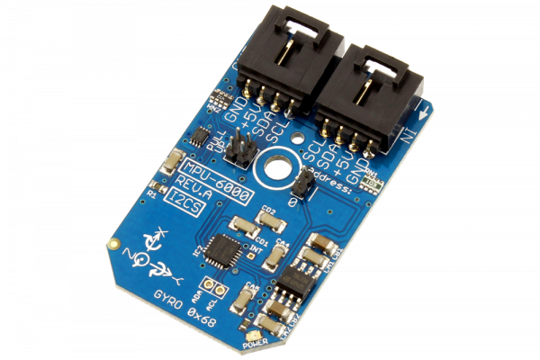

[](https://store.ncd.io/product/mpu-6000-aka-mpu-6050-6-axis-motiontracking-3-axis-gyroscope-3-axis-accelerometer-digital-motion-processor-i2c-mini-module/).

#  MPU6000

InvenSense’s MPU-6000 is the world’s first integrated 6-axis MotionTracking device that combines a 3-axis gyroscope, 3-axis accelerometer, and a Digital Motion Processor™ (DMP). With its dedicated I2C sensor bus, it directly accepts inputs from an external 3-axis compass to provide a complete 9-axis MotionFusion™ output. The MPU-6000 is also designed to interface with multiple non-inertial digital sensors, such as pressure sensors, on its auxiliary I2C port.
This Device is available from www.ncd.io 

[SKU: MPU6000]

(https://store.ncd.io/product/mpu-6000-aka-mpu-6050-6-axis-motiontracking-3-axis-gyroscope-3-axis-accelerometer-digital-motion-processor-i2c-mini-module/)
This Sample code can be used with Raspberry Pi.

Hardware needed to interface MPU6000 6axis motion tracking,3axis gyroscope and 3axis accelometer sensor With Raspberry Pi :
1. <a href="https://store.ncd.io/product/mpu-6000-aka-mpu-6050-6-axis-motiontracking-3-axis-gyroscope-3-axis-accelerometer-digital-motion-processor-i2c-mini-module/">MPU6000 6axis motion tracking,3axis gyroscope and 3axis accelometer sensor</a>
2.  <a href="https://store.ncd.io/product/i2c-shield-for-raspberry-pi-3-pi2-with-outward-facing-i2c-port-terminates-over-hdmi-port/">Raspberry Pi I2C Shield</a>
3. <a href="https://store.ncd.io/product/i%C2%B2c-cable/">I2C Cable</a>

## Python
Download and install smbus library on Raspberry pi. Steps to install smbus are provided at:

https://pypi.python.org/pypi/smbus-cffi/0.5.1

Download (or git pull) the code in pi. Run the program.

```cpp
$> python MPU6000.py
```
The lib is a sample library, you will need to calibrate the sensor according to your application requirement.
